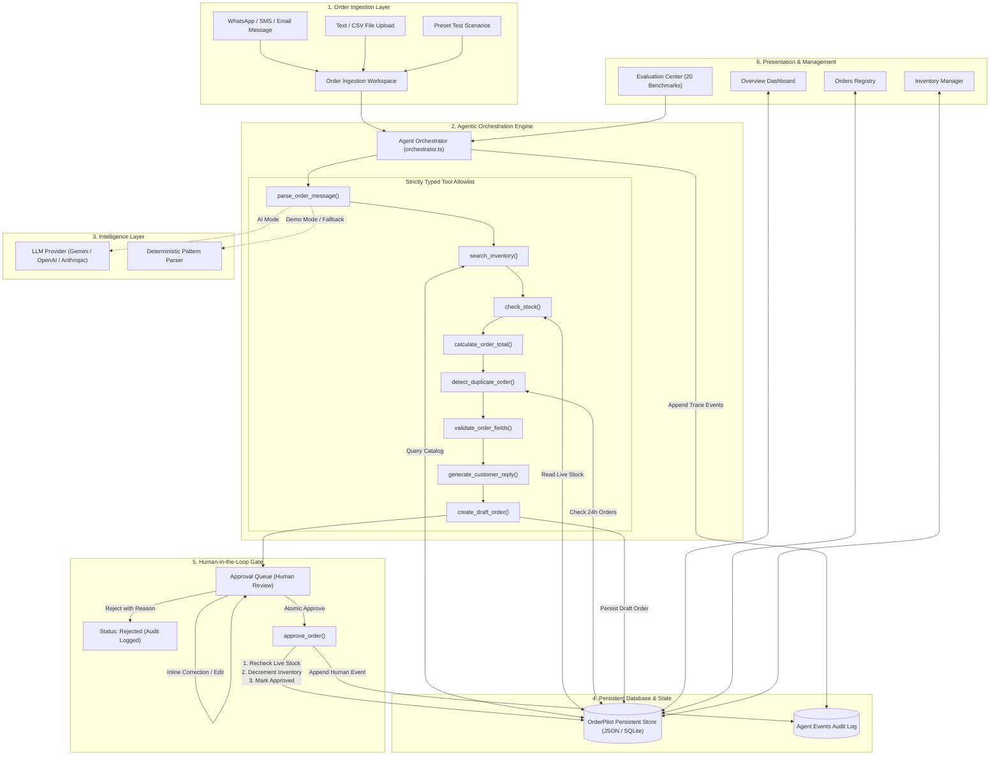

# OrderPilot AI — Technical Architecture

## Architectural Philosophy & Core Principles

OrderPilot AI is engineered as an **Operational Agentic Copilot** rather than a passive chatbot. It translates unstructured natural-language customer orders into structured, mathematically validated, inventory-verified draft orders requiring explicit human merchant authorization.

### Key Architectural Tenets:
1. **Tool-Driven Execution**: LLMs are utilized strictly for semantic extraction and contextual drafting; all business logic, financial arithmetic, and stock adjustments are deterministic.
2. **Deterministic Fallback (Demo Mode)**: The application delivers 100% operational functionality without external API keys via a high-performance rule-based extractor.
3. **Atomic Human-in-the-Loop Sign-off**: No external order confirmation is dispatched and no physical inventory is decremented without an authenticated human review event.
4. **Immutable Auditability**: Every agent action, tool invocation, duration, and reviewer decision is appended to an immutable audit ledger.

---

## High-Level Architecture Diagram

---

## Detailed Component Breakdown

### 1. Ingestion Layer (`src/components/workspace/OrderWorkspace.tsx`)
- Accepts raw text pasted by store managers, `.txt` or `.csv` batch files, or 6 pre-configured realistic test presets.
- Preserves raw input string (`raw_message`) in the database for complete historical traceability.

### 2. Orchestration Pipeline (`src/lib/agent/orchestrator.ts`)
The orchestrator executes a linear, transparent, measurable sequence of 7 steps:
1. **Session Initialization**: Creates a unique `ProcessingSession` with source metadata.
2. **Message Parsing (`parse_order_message`)**: Identifies customer name, contact details, delivery address, and requested items with quantities and variants.
3. **Inventory Disambiguation (`search_inventory`)**: Evaluates real catalog items against tokenized query strings. Distinguishes between exact matches, partial matches, ambiguous variant matches, and unknown items.
4. **Stock Verification (`check_stock`)**: Evaluates live physical quantities. Flags `in_stock`, `low_stock`, or `insufficient_stock`.
5. **Deterministic Calculation (`calculate_order_total`)**: Computes subtotal, tax rate (default 5%), and conditional delivery fees ($5.00 or free above $50.00). *LLMs are never permitted to perform financial math.*
6. **Duplicate Screening (`detect_duplicate_order`)**: Evaluates whether the same customer submitted identical line items within the preceding 24 hours.
7. **Business Validation & Response Generation (`validate_order_fields` & `generate_customer_reply`)**: Flags blocking constraints (missing address or stock shortages) and prepares an editable, copyable customer response draft marked clearly as an AI-generated draft.

### 3. Human Approval Gate (`src/components/orders/ApprovalQueue.tsx`)
- Prevents premature state commitment or automated messaging.
- Allows merchants to edit extracted customer details, fix typos, adjust quantities, or resolve ambiguous variants.
- Executes an **Atomic Transaction** on approval:
  1. Reloads live inventory from disk.
  2. Confirms no missing required fields.
  3. Rechecks stock availability to prevent overselling.
  4. Decrements inventory counts.
  5. Updates order status to `approved`.
  6. Appends a human approval record to `approval_events` and `agent_events`.

### 4. Data Layer (`src/lib/db.ts` & `src/lib/schema.sql`)
- Strict typed schema matching relational database specifications:
  - `products`: Catalog items, prices, stock levels, safety thresholds, and variants.
  - `orders`: Ingested orders with status lifecycle (`draft`, `needs_clarification`, `pending_approval`, `approved`, `rejected`, `cancelled`).
  - `order_items`: Snapshots item unit prices, product names, and variants at order creation time to maintain financial historical integrity.
  - `processing_sessions`: Execution metadata, confidence scores, and mode flags.
  - `agent_events`: Detailed audit trail tracking every tool execution and summary.
  - `approval_events`: Human review records, reviewer identities, and notes.

---

## Agent Actions vs. Human Actions

To guarantee safety and merchant trust, OrderPilot AI enforces a strict boundary between automated preparation and human commitment:

| Operational Dimension | Automated Agent Actions | Mandatory Human Reviewer Actions |
| :--- | :--- | :--- |
| **Message Ingestion** | Ingests conversational message; extracts names, addresses, items | Authorizes or corrects misparsed details |
| **Catalog Matching** | Fuzzy & token searches products; calculates confidence | Resolves ambiguous variants or unknown items |
| **Stock Check** | Queries live stock; flags shortages | Decides whether to fulfill partial order or substitute |
| **Financial Math** | Deterministically computes subtotal, taxes, delivery fee | Verifies total price and applies custom discounts |
| **Customer Messaging** | Drafts contextual confirmation/clarification text | Copies, customizes, or sends message manually |
| **Database State** | Creates non-committal `draft` or `pending_approval` record | **Executes atomic `approve_order` or `reject_order`** |
| **Inventory Ledger** | **Read-only**: Never modifies physical stock counts | **Write-authorized**: Decrements stock upon approval |

### Why Human Approval Exists
1. **Consequential Business Actions**: Changing inventory counts and sending commercial promises directly impact business revenue and customer relationships. An autonomous system should prepare the work, but a responsible merchant must verify the commitment.
2. **Ambiguity Resolution**: When a customer requests *"2 cotton shirts"* without specifying Medium or Large, the agent flags the ambiguity rather than guessing. The merchant clarifies the choice with the customer.
3. **Legal & Financial Safety**: Tax calculations, addresses, and delivery commitments require accountability. The human reviewer provides the authenticated sign-off.

