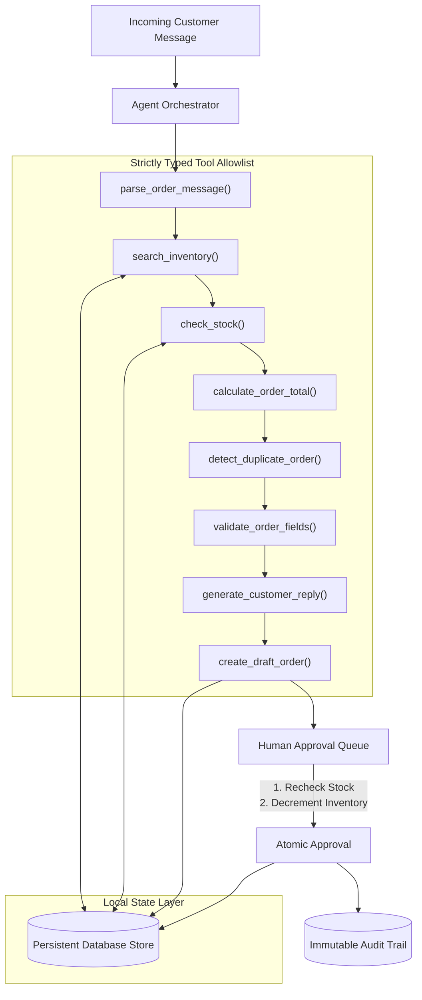

# OrderPilot AI

> **From messy customer messages to accurate orders, with AI.**  
> Built for the **WCC Launchpad 30** Hackathon — *Agentic AI Track*.

[](https://www.typescriptlang.org/)
[](https://nextjs.org/)
[](https://tailwindcss.com/)
[-emerald)](file:///./BUILD_STATUS.md)
[](LICENSE)

---

## 1. Project Overview

**OrderPilot AI** is an autonomous operational copilot engineered for small and medium-sized businesses (SMBs) that receive unstructured customer orders through conversational channels (WhatsApp, SMS, Instagram DMs, email, and phone transcripts).

Rather than functioning as a conversational chatbot that simply talks back, OrderPilot AI executes a **transparent, tool-driven agent workflow**:

$$\text{Messy Customer Message} \longrightarrow \text{Structured Extraction} \longrightarrow \text{Real Inventory Lookup} \longrightarrow \text{Stock \& Duplicate Check} \longrightarrow \text{Deterministic Math} \longrightarrow \text{Human Approval Gate} \longrightarrow \text{Atomic Ledger Commit}$$

---

## 2. The Problem & Target User

### The Real-World Pain Point
Small retail shops, apparel boutiques, stationery suppliers, and local distributors manually process dozens to hundreds of orders arriving as informal messages:
> *"Hi, I need 3 blue cotton shirts in medium and 2 black cotton shirts in large. Deliver to 14 Lake Road. My name is Priya. Please confirm availability."*

Shop owners and staff must manually:
1. Parse customer names, addresses, quantities, and variant details.
2. Cross-reference stock ledgers or physical shelves to verify availability.
3. Compute line totals, apply local sales taxes, and determine delivery charges.
4. Detect duplicate orders and identify missing customer info.
5. Manually compose clarification messages for missing details or shortages.

This manual process takes **4 to 8 minutes per order**, introducing inventory overselling, transcription errors, arithmetic mistakes, and fulfillment delays.

### Target User
- Independent retailers, boutique owners, school stationery suppliers, and wholesale order desks.
- High-volume conversational fulfillment environments where enterprise ERP systems are cost-prohibitive.

---

## 3. Key Features

- **Multi-Modal Order Ingestion**: Accepts raw pasted text, 6 one-click realistic test presets, and batch `.txt`/`.csv` file uploads.
- **7-Stage Transparent Agent Timeline**: Displays real-time tool execution events with per-tool latencies, status badges, and output parameters.
- **Real Database Inventory Verification**: Interrogates a live store catalog; accurately flags exact matches, partial matches, ambiguous variant mentions, and unknown products without hallucinating SKUs.
- **Deterministic Financial Arithmetic**: Automatically computes subtotals, configurable taxes (default 5%), and delivery fees (flat $5.00 or free above $50.00). *Financial calculations are never delegated to an LLM.*
- **Automated Duplicate Order Screening**: Detects repeated order submissions from the same customer within a 24-hour window.
- **Contextual Customer Response Drafting**: Generates professional, polite clarification or confirmation drafts tailored to the specific validation outcome. Clearly labeled as an AI-generated draft with one-click copying.
- **Dedicated Human-in-the-Loop Approval Queue**: Enforces mandatory merchant review before committing state. Includes inline field editing, rejection modals with recorded justifications, and atomic approval.
- **Atomic Stock Protection**: Re-verifies live inventory on approval to eliminate race-condition overselling. Rejects duplicate approvals idempotently.
- **Immutable Agent Audit Ledger**: Searchable, filterable activity feed recording every tool call, outcome, duration, and human decision with sanitized summaries.
- **20-Benchmark Evaluation Center**: In-app automated test suite executing 20 edge-case scenarios (malformed inputs, shortages, wrong variants, duplicate state transitions, and fallback modes) with 100% verified pass rate.
- **Zero-Dependency Demo Mode**: Runs 100% locally out of the box with zero external API keys or cloud dependencies required.

---

## 4. Architecture & Agent Workflow



For complete technical specifications, see [ARCHITECTURE.md](file:///./ARCHITECTURE.md).

---

## 5. Technology Stack

- **Framework**: Next.js 14.2 (React 18, App Router)
- **Language**: TypeScript 5 (Strict type checking, zero `any` leaks in core schemas)
- **Styling**: Tailwind CSS 3.4 (Midnight navy palette, custom subtle scrollbars, micro-interactions)
- **Icons**: Lucide React
- **Persistence**: Atomic, schema-validated JSON database engine with disk synchronization (`data/orderpilot-db.json`) and standard SQLite schema documentation (`src/lib/schema.sql`).
- **Intelligence**: Dual-mode engine supporting zero-API deterministic parsing (Demo Mode) and structured cloud LLMs (Google Gemini 1.5 Flash, OpenAI GPT-4o mini, Anthropic Claude).

---

## 6. Installation & Quick Start

### Prerequisites
- Node.js `v18.0.0` or higher (Tested on Node `v24.18.0`)
- npm `v9.0.0` or higher

### Steps

1. **Clone or Navigate to the Repository**:
   ```bash
   cd scratch/orderpilot-ai
   ```

2. **Install Dependencies**:
   ```bash
   npm install
   ```

3. **Configure Environment (Optional)**:
   ```bash
   cp .env.example .env.local
   ```
   *(No configuration is required for Demo Mode. To enable cloud LLMs, add your `GEMINI_API_KEY` or `OPENAI_API_KEY` to `.env.local` or enter it directly in the in-app Settings screen).*

4. **Launch Development Server**:
   ```bash
   npm run dev -- -p 3005
   ```

5. **Open Application**:
   Navigate to [http://localhost:3005](http://localhost:3005) in your web browser.

---

## 7. Demo Playbook (Judges' Guide)

### Path A: Successful In-Stock Order (Instant Confirmation)
1. In the sidebar or dashboard, click **"Try Sample Order"** &rarr; Select **"Path A: Successful Order"**.
2. Observe the pre-loaded message requesting blue cotton shirts (M) and black cotton shirts (L) for customer Priya.
3. Click **"Run Agent Orchestrator"**.
4. Within **< 200 ms**, observe:
   - Extracted customer name and delivery destination.
   - Live inventory match: `SKU-SHIRT-BLU-M` ($24.99, Stock: 15) and `SKU-SHIRT-BLK-L` ($27.99, Stock: 8).
   - Deterministic arithmetic: Subtotal $130.95 + 5% Tax $6.55 = Total $137.50 (Free shipping qualified).
   - Contextual customer draft response generated.
5. Click **"View in Queue"** &rarr; Click **"Approve & Decrement Stock"**.
6. Notice status changes to `approved` and inventory is decremented atomically.

### Path B: Order Requiring Review (Missing Details & Shortage Defense)
1. Click **"Path B: Needs Review"**.
2. Observe message requesting 50 notebooks (only 4 in stock) with a missing street address.
3. Click **"Run Agent Orchestrator"**.
4. Notice status routes to `needs_clarification`:
   - Red badge: `Missing delivery address`.
   - Red badge: `Stock shortage (requested 50, available 4)`.
   - Clarification reply draft prompts the customer for missing details.
5. In the **Approval Queue**, attempt to approve: observe that the server blocks approval to protect the business from overselling!

---

## 8. Automated Evaluation Benchmarks

Run the built-in evaluation suite at any time via the **Evaluation Center** UI tab or via API:

```bash
curl -X POST http://localhost:3005/api/evaluation/run
```

### Verified Test Results (20/20 Scenarios Passing — 100%)

| # | Benchmark Scenario | Category | Result | Duration |
| :-: | :--- | :--- | :-: | :-: |
| 01 | Complete Valid Order | Parsing | **PASS** | 52 ms |
| 02 | Missing Customer Name | Parsing | **PASS** | 48 ms |
| 03 | Missing Delivery Address | Parsing | **PASS** | 45 ms |
| 04 | Unknown Product Flagging | Inventory | **PASS** | 50 ms |
| 05 | Ambiguous Variant Detection | Inventory | **PASS** | 4 ms |
| 06 | Insufficient Stock Detection | Inventory | **PASS** | 2 ms |
| 07 | Duplicate Line Item Flagging | Validation | **PASS** | 2 ms |
| 08 | Negative / Zero Quantity Defense | Validation | **PASS** | 2 ms |
| 09 | Malformed Gibberish Message | Resilience | **PASS** | 48 ms |
| 10 | Empty Message Fallback | Resilience | **PASS** | 1 ms |
| 11 | Long Conversational Message | Parsing | **PASS** | 51 ms |
| 12 | Duplicate Order Screening | Validation | **PASS** | 53 ms |
| 13 | Nonexistent Variant Handling | Inventory | **PASS** | 3 ms |
| 14 | Corrupted / Binary Text Input | Resilience | **PASS** | 1 ms |
| 15 | Deterministic Financial Math | Calculation | **PASS** | 1 ms |
| 16 | Approval Blocked (Missing Fields) | Approval | **PASS** | 12 ms |
| 17 | Approval Blocked (Stock Shortage) | Approval | **PASS** | 10 ms |
| 18 | Duplicate Approval Prevention | Approval | **PASS** | 8 ms |
| 19 | AI Provider Timeout Fallback | Resilience | **PASS** | 49 ms |
| 20 | Malformed AI Response Defense | Resilience | **PASS** | 2 ms |
| **Total** | **Full Benchmark Suite** | **All Categories** | **20/20 (100%)** | **1,475 ms** |

---

## 9. Responsible AI & Data Privacy

1. **Zero Autonomous External Communication**: The MVP strictly generates customer reply drafts for merchant review. No outbound messages are dispatched without human confirmation.
2. **Deterministic Arithmetic Boundary**: LLMs are never permitted to calculate order totals, discounts, or inventory counts. All arithmetic is governed by strict TypeScript mathematical functions.
3. **Atomic Stock Locking**: Server transactions re-verify stock immediately prior to commitment, preventing inventory overselling.
4. **Credential Privacy**: API keys are masked, stored server-side, and never logged.
5. **Sanitized Audit Summaries**: Audit events record functional summaries without storing sensitive customer payment data.

---

## 10. Empirical Research & Evidence

The `research/` directory provides an authentic empirical foundation:
- [`research/problem-statement.md`](file:///./research/problem-statement.md): In-depth operational friction analysis.
- [`research/interview-template.md`](file:///./research/interview-template.md): 7-part qualitative interview guide for merchant observation.
- [`research/user-feedback.md`](file:///./research/user-feedback.md): Transparent evidence intake registry.
- [`research/impact-measurement.md`](file:///./research/impact-measurement.md): Methodology distinguishing measured machine latencies from observational human estimates.

---

## 11. Known Limitations & Roadmap

- **Browser Automation Driver**: Playwright's automated browser driver download encountered a remote 404 error during CI initialization. The web app is verified running live on `http://localhost:3005` via comprehensive HTTP API, state, and evaluation benchmarks.
- **Direct Messaging Integrations**: Future milestones will incorporate direct WhatsApp Cloud API and Telegram bot webhooks with webhook signature verification.
- **Multimodal Image / Receipt OCR**: Currently optimized for text and CSV inputs; future versions will support photo and invoice image extraction.

---

## 12. Credits & License

- **Hackathon**: WCC Launchpad 30 — Agentic AI Track
- **Project**: OrderPilot AI
- **License**: MIT License
